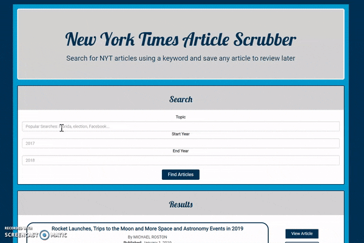

# New York Times-Scrubber

React-based New York Times article search application that allows users to query and display articles based on their searches and to save articles to read later.

## Getting Started

Please go to the link for [NYT Scrubber](https://nyt-scrubber-app.herokuapp.com/).

Search for a topic of interest, and the range of years for articles. Based on the information entered, the New York Times API will be queried.

The headline, byline, publication date, and a snippet of the top 5 articles returned from the API are displayed. Users can click View Article to see go to the article URL in a new window or save the article for viewing later. Articles saved will be visible in the saved panel for for future sessions unless deleted

## Deployment

This application is deployed using [Heroku](http://www.heroku.com) and mLab.

## Built With

- [React.js](https://reactjs.org/) - A JavaScript library for building user interfaces
- [Express](https://www.npmjs.com/package/express) - Server Framework
- [MongoDB](https://www.mongodb.com/) - Database Management system used locally
- [Mongoose](http://docs.sequelizejs.com/) - MongoDB object modeling tool
- [MLab](https://www.mlab.com/home) - Database Management system when deployed
- [Node.JS](https://nodejs.org/en/) - Server-side Javascript language
- [Axios](https://www.npmjs.com/package/axios) - Promised based HTTP client for the browser and node

## Demo
Search for an article by key work and an optional year range:

## Get It Working Locally

1. Clone the repository
2. Request an API key from the New York Times
3. Create a .env file and add the following: REACT_APP_NYT_KEY=your_key_from_NYT
4. Run yarn install to install the npm packages
5. Run 'yarn start' to get the development server running!

## Future Developments

This application is continuously being approved. Check back for the latest updates!

## Author

Lisa Vinson

- [Github](https://github.com/LiVinson)
- [Portfolio](www.LisaVinson.com)
